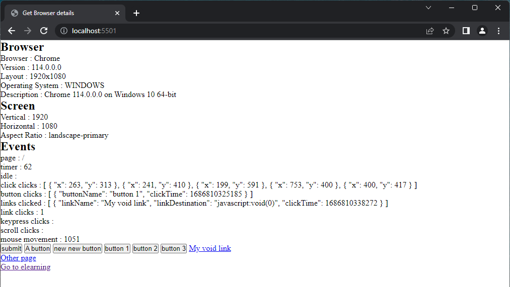

# Self-Hosted web analytics engine

This is an open-source web analytics processing engine.  
Website owners can use it to track website visitor's device and browser data and how they interact with the website.  
This is the back end component of the system

## Technologies

Frontend - Angular  
Theming - Material UI  
Charts - ApexCharts  
Backend - Java/Spring Boot  
Database - PostgresSql  

## Installing

<ul>
<li>navigate to src -> main -> resources -> static -> then copy the collection script 
to your website pages and rename the ServerUrl to your server</li>

<li>Install the gradle dependencies and run</li>
</ul>

The server will then run on port 8080
This is only the backend and will need to be connected to the 
<a href="https://github.com/stanmpakati/analytics-dashboard">Analytics Dashboard</a> to work properly
 

## Demo

The collection script at work   